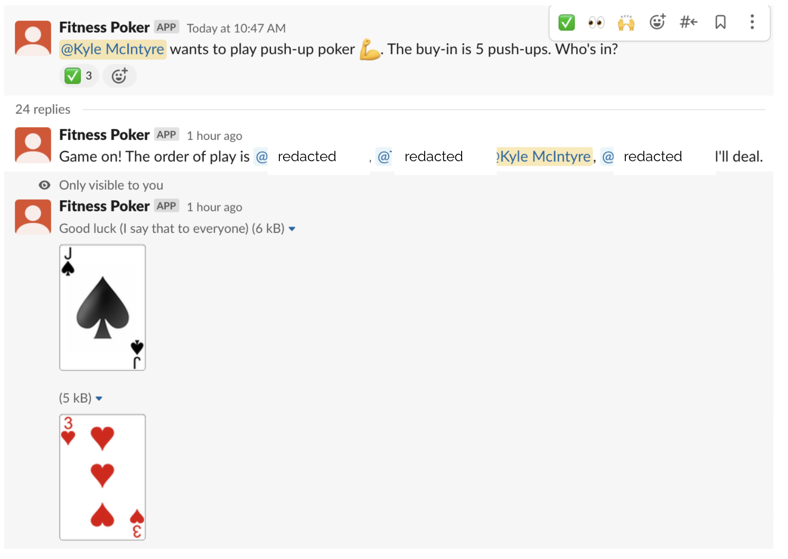

# Slack Fitness Poker 🃏💪

Texas Hold'em for Slack where bets are workouts (pushups, squats, planks, etc.) not money. Fun for remote teams!



## Features
- **Slash command `/game [league]`**: Start game (e.g. `/game push-up`, `/game random`).
- **Leagues**: push-up, sit-up, burpee, squat, lunge, plank, knuckle-up, russian-twist, push-plank, rupee, chin-up, random.
- **High stakes**: `/game push-up high-stakes` doubles buy-in.
- **Reactions join**: First 4 reactors play in thread.
- **SQLite DB**: Local games persistent.
- **Nginx proxy + Let's Encrypt**: Production HTTPS.
- **Systemd service**: Auto-start/restart.

## Quick Setup (Local/VPS)
1. **Clone**:
   ```
   git clone git@github.com:kylejmcintyre/slack-fitness-poker.git
   cd slack-fitness-poker
   ```

2. **Venv & Deps**:
   ```
   python3 -m venv poker-env
   source poker-env/bin/activate
   pip install -r requirements.txt
   ```

3. **.env** (copy template, fill Slack values):
   ```
   cp .env.example .env  # or create
   # SLACK_BOT_TOKEN=xoxb-...
   # SLACK_BOT_SECRET=...
   # SLACK_CHANNEL=poker
   ```

4. **DB**:
   ```
   python poker/local_db.py
   ```

5. **Run**:
   ```
   ./start-poker.sh
   ```
   - Configs nginx, starts Gunicorn.
   - Access: https://your-domain (port 5000 proxied).

## Production (Ubuntu VPS)
- **Nginx/SSL**: `./start-poker.sh` auto-configs (Certbot separate).
- **Systemd**:
  ```
  sudo cp slack-poker.service /etc/systemd/system/
  sudo systemctl daemon-reload
  sudo systemctl enable --now slack-poker.service
  ```
- Logs: `journalctl -fu slack-poker.service`
- Nginx: `/var/log/nginx/`

## Slack App Setup
1. [api.slack.com/apps](https://api.slack.com/apps) > Create App.
2. **Bot Token Scopes**: `commands`, `chat:write`, `reactions:read`.
3. **Slash Commands**: `/game` → Request URL `https://your-domain/bolt`.
4. Install to workspace, copy **Bot User OAuth Token** (xoxb-...) & **Signing Secret**.
5. Add bot to #poker channel.

**Leagues** (see `poker/structures.py`): push-up, sit-up, burpee, squat, lunge, plank, knuckle-up, russian-twist, push-plank, rupee, chin-up, `random`.

## Troubleshooting
- **Timeout/502**: Check gunicorn workers `ps aux | grep gunicorn`, logs.
- **Token error**: Verify .env/Slack app.
- **Nginx warn**: Ignore deprecation or update template.
- Mem low: Edit script `--workers 2`.

## License
MIT

Contribute/PR welcome!